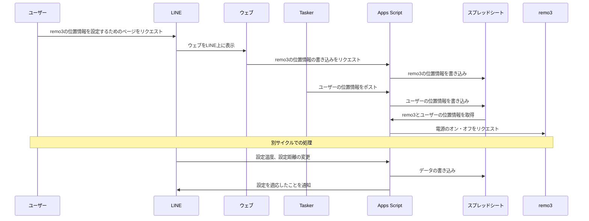
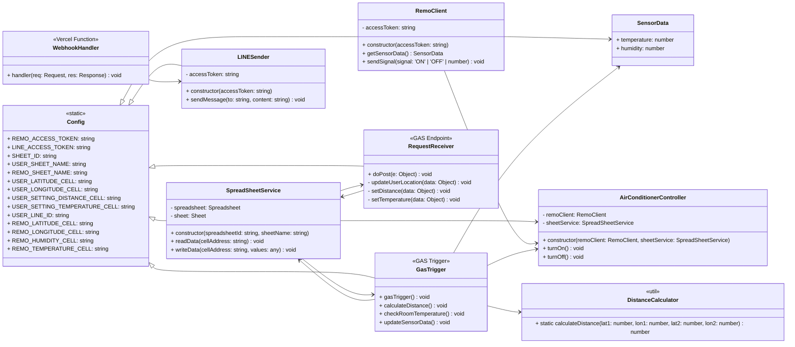

# 家電自動制御システム

## 概要

LINE と Nature Remo を連携させ、ユーザーの位置情報に基づいて家電（主にエアコン）を自動で制御するシステムです。

## 主な機能

- **位置情報に基づくエアコン制御:**
    - ユーザーが自宅から設定した距離内に入ると、エアコンを自動でONにします。
    - ユーザーが自宅から設定した距離外に出ると、エアコンを自動でOFFにします。
- **LINEによる各種設定:**
    - LINEのLIFFアプリを通じて、自宅の場所、エアコンの作動を開始する距離、設定温度などを簡単に設定できます。
- **センサーデータ連携:**
    - Nature Remoのセンサー（温度・湿度）から取得したデータをスプレッドシートに記録します。

## アーキテクチャ

本システムは、以下のサービスを連携させて動作しています。

- **LINE Messaging API:** ユーザーとのインターフェースを提供します。
- **Google Apps Script (GAS):** メインのロジックを担い、定期的な処理（トリガー）や外部からのリクエストを処理します。
- **Google スプレッドシート:** ユーザー設定、位置情報、センサーデータなどを管理するデータベースとして利用します。
- **Nature Remo:** 赤外線リモコンとして、エアコンなどの家電を操作します。
- **Vercel (オプション):** Webhookを処理するためのサーバーレス機能を提供します。（`webApp/api/webhook.js`が存在する場合）
- **Tasker (Androidアプリ):** ユーザーのスマートフォンから定期的に位置情報をGASへ送信します。

### シーケンス図



### クラス図



## 使用技術スタック

- **フロントエンド:**
    - HTML/CSS/JavaScript
    - [particles.js](https://github.com/VincentGarreau/particles.js/): 背景のアニメーションに使用
    - [sanitize.css](https://github.com/csstools/sanitize.css): ブラウザのデフォルトスタイルをリセット
- **バックエンド (GAS):**
    - Google Apps Script (JavaScript)
- **データベース:**
    - Google スプレッドシート
- **外部API:**
    - LINE Messaging API (LIFF)
    - Nature Remo API
- **その他:**
    - [clasp](https://github.com/google/clasp): GASのローカル開発用CLIツール
    - [Tasker](https://tasker.joaoapps.com/): Androidの自動化アプリ（位置情報送信に使用）

## セットアップ

### 1. Google Apps Script (GAS) の設定

1.  `clasp` を使用して、`src` ディレクトリ内のファイルをGoogle Apps Scriptプロジェクトにプッシュします。
2.  スクリプトプロパティに以下のキーと値を設定します。
    *   `REMO_ACCESS_TOKEN`: Nature Remoのアクセストークン
    *   `LINE_ACCESS_TOKEN`: LINE Messaging APIのチャネルアクセストークン
    *   `SHEET_ID`: 設定を保存するGoogleスプレッドシートのID
    *   `USER_LINE_ID`: 通知を送る対象のLINEユーザーID

### 2. Google スプレッドシートの設定

-   `User` と `Remo` という名前の2つのシートを作成します。
-   各シートのセルに必要な初期設定値を入力します。（詳細は `src/config.js` を参照）

### 3. LIFFアプリの設定

1.  LINE DevelopersコンソールでLIFFアプリを作成します。
2.  エンドポイントURLに、デプロイしたウェブアプリケーションのURL (`webApp/index.html`) を設定します。
3.  `webApp/index.html` 内の `liff.init` の `liffId` を、作成したLIFFアプリのIDに書き換えます。

### 4. GASトリガーの設定

-   `gasTrigger` 関数を、定期的に（例: 5分ごと）実行するようにトリガーを設定します。

## ディレクトリ構成

```
.
├── .clasp.json
├── .claspignore
├── appsscript.json
├── architectures/      # 設計図
│   ├── class.md
│   ├── classDia.pdf
│   ├── sequence.md
│   └── sequence.pdf
├── src/                # GASのソースコード
│   ├── config.js
│   ├── LINESender.js
│   ├── remoClient.js
│   ├── RequestReceiver.js
│   ├── sensorData.js
│   ├── useCase/
│   │   ├── airConditionerController.js
│   │   └── gasTrigger.js
│   └── utils/
│       ├── distanceCalculator.js
│       └── spreadSheetService.js
└── webApp/             # LIFFアプリのフロントエンド
    ├── index.html
    ├── main.js
    ├── particles.js
    ├── register.mp3
    ├── setting.js
    ├── style.css
    └── api/
        └── webhook.js
```
