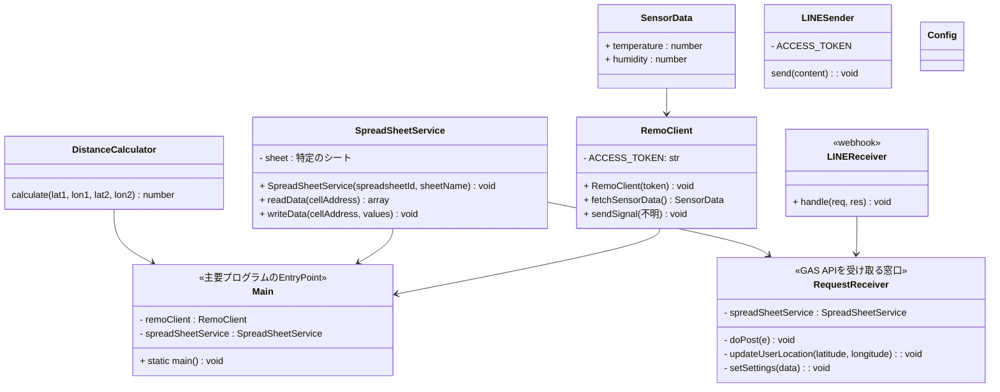

```mermaid
classDiagram
    SensorData --> RemoClient
    RemoClient --> Main
    SpreadSheetService --> Main
    LINEReceiver --> RequestReceiver
    SpreadSheetService --> RequestReceiver
    DistanceCalculator --> Main
    class SpreadSheetService {
        - sheet : 特定のシート
        + SpreadSheetService(spreadsheetId, sheetName) void
        + readData(cellAddress) array
        + writeData(cellAddress, values) void
    }
    class RemoClient {
        - ACCESS_TOKEN: str
        + RemoClient(token) void
        + fetchSensorData() SensorData
        + sendSignal(不明) void
    }
    class SensorData {
        + temperature : number
        + humidity : number
    }
    class LINEReceiver {
        <<webhook>>
        + handle(req, res) void
    }
    class Main {
        <<主要プログラムのEntryPoint>>
        - remoClient : RemoClient
        - spreadSheetService : SpreadSheetService
        + static main() void
    }
    class RequestReceiver {
        <<GAS APIを受け取る窓口>>
        - spreadSheetService : SpreadSheetService
        - doPost(e) void
        - updateUserLocation(latitude, longitude) : void
        - setSettings(data) : void
    }
    class LINESender {
        - ACCESS_TOKEN
        send(content) : void
    }
    class Config {
        
    }
    class DistanceCalculator {
        calculate(lat1, lon1, lat2, lon2) number
    }
```