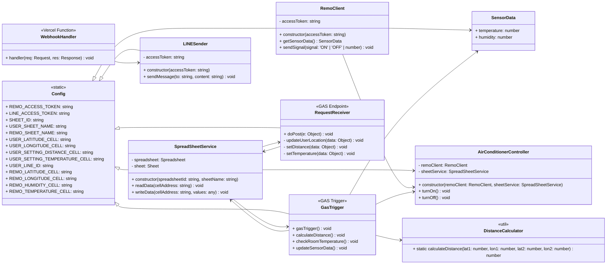

```mermaid
classDiagram
    direction LR

    class Config {
        <<static>>
        + REMO_ACCESS_TOKEN: string
        + LINE_ACCESS_TOKEN: string
        + SHEET_ID: string
        + USER_SHEET_NAME: string
        + REMO_SHEET_NAME: string
        + USER_LATITUDE_CELL: string
        + USER_LONGITUDE_CELL: string
        + USER_SETTING_DISTANCE_CELL: string
        + USER_SETTING_TEMPERATURE_CELL: string
        + USER_LINE_ID: string
        + REMO_LATITUDE_CELL: string
        + REMO_LONGITUDE_CELL: string
        + REMO_HUMIDITY_CELL: string
        + REMO_TEMPERATURE_CELL: string
    }

    class SpreadSheetService {
        - spreadsheet: Spreadsheet
        - sheet: Sheet
        + constructor(spreadsheetId: string, sheetName: string)
        + readData(cellAddress: string) void
        + writeData(cellAddress: string, values: any) void
    }

    class RemoClient {
        - accessToken: string
        + constructor(accessToken: string)
        + getSensorData() SensorData
        + sendSignal(signal: 'ON' | 'OFF' | number) void
    }

    class SensorData {
        + temperature: number
        + humidity: number
    }

    class DistanceCalculator {
        <<util>>
        + static calculateDistance(lat1: number, lon1: number, lat2: number, lon2: number) number
    }

    class LINESender {
        - accessToken: string
        + constructor(accessToken: string)
        + sendMessage(to: string, content: string) void
    }

    class RequestReceiver {
        <<GAS Endpoint>>
        + doPost(e: Object) void
        - updateUserLocation(data: Object) void
        - setDistance(data: Object) void
        - setTemperature(data: Object) void
    }

    class WebhookHandler {
        <<Vercel Function>>
        + handler(req: Request, res: Response) void
    }

    class AirConditionerController {
        - remoClient: RemoClient
        - sheetService: SpreadSheetService
        + constructor(remoClient: RemoClient, sheetService: SpreadSheetService)
        + turnOn() void
        + turnOff() void
    }

    class GasTrigger {
        <<GAS Trigger>>
        + gasTrigger() void
        + calculateDistance() void
        + checkRoomTemperature() void
        + updateSensorData() void
    }

    %% 関連性
    Config <|-- RemoClient
    Config <|-- SpreadSheetService
    Config <|-- RequestReceiver
    Config <|-- LINESender
    Config <|-- GasTrigger

    SpreadSheetService --> RequestReceiver
    SpreadSheetService --> GasTrigger
    SpreadSheetService --> AirConditionerController

    RemoClient --> SensorData
    RemoClient --> AirConditionerController

    GasTrigger --> DistanceCalculator
    GasTrigger --> AirConditionerController
    GasTrigger --> SensorData
    GasTrigger --> SpreadSheetService

    RequestReceiver --> SpreadSheetService

    WebhookHandler --> LINESender
```