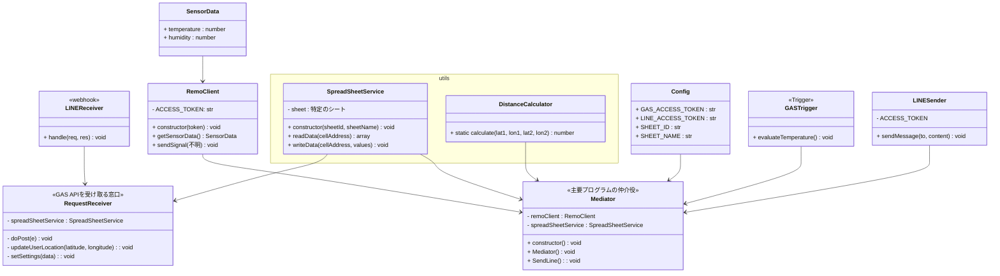

```mermaid
classDiagram
    SensorData --> RemoClient
    RemoClient --> Mediator
    SpreadSheetService --> Mediator
    LINEReceiver --> RequestReceiver
    SpreadSheetService --> RequestReceiver
    DistanceCalculator --> Mediator
    Config --> Mediator
    GASTrigger --> Mediator
    LINESender --> Mediator
    namespace utils {
        class SpreadSheetService {
            - sheet : 特定のシート
            + constructor(sheetId, sheetName) void
            + readData(cellAddress) array
            + writeData(cellAddress, values) void
    }
    }
    class RemoClient {
        - ACCESS_TOKEN: str
        + constructor(token) void
        + getSensorData() SensorData
        + sendSignal(不明) void
    }
    class SensorData {
        + temperature : number
        + humidity : number
    }
    class LINEReceiver {
        <<webhook>>
        + handle(req, res) void
    }
    class Mediator {
        <<主要プログラムの仲介役>>
        - remoClient : RemoClient
        - spreadSheetService : SpreadSheetService
        + constructor() void
        + Mediator() void
        + SendLine() : void
    }
    class RequestReceiver {
        <<GAS APIを受け取る窓口>>
        - spreadSheetService : SpreadSheetService
        - doPost(e) void
        - updateUserLocation(latitude, longitude) : void
        - setSettings(data) : void
    }
    class LINESender {
        - ACCESS_TOKEN
        + sendMessage(to, content) void
    }
    class Config {
        + GAS_ACCESS_TOKEN : str
        + LINE_ACCESS_TOKEN : str
        + SHEET_ID : str
        + SHEET_NAME : str
    }
    namespace utils {
        class DistanceCalculator {
        + static calculate(lat1, lon1, lat2, lon2) number
        }
    }
    class GASTrigger {
        <<Trigger>>
        + evaluateTemperature() void
    }
```