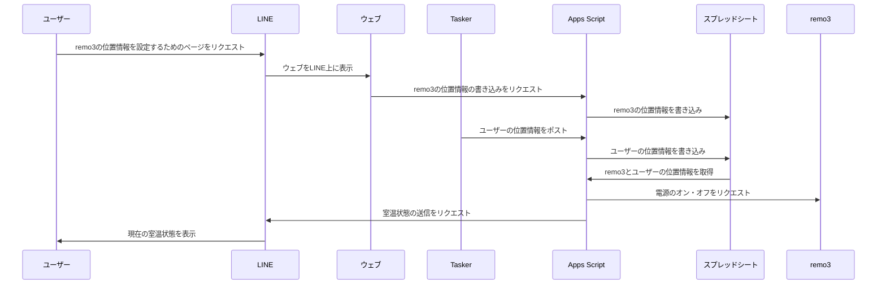

```mermaid
sequenceDiagram
	participant ユーザー
	participant LINE
	participant ウェブ
	participant Tasker
	participant Apps Script
	participant スプレッドシート
	participant remo3
	ユーザー->>LINE: remo3の位置情報を設定するためのページをリクエスト
	LINE->>ウェブ: ウェブをLINE上に表示
	ウェブ->>Apps Script: remo3の位置情報の書き込みをリクエスト
	Apps Script->>スプレッドシート: remo3の位置情報を書き込み
	Tasker->>Apps Script: ユーザーの位置情報をポスト
	Apps Script->>スプレッドシート: ユーザーの位置情報を書き込み
	スプレッドシート->>Apps Script: remo3とユーザーの位置情報を取得
	Apps Script->>remo3: 電源のオン・オフをリクエスト
	Apps Script->>LINE: 室温状態の送信をリクエスト
	LINE->>ユーザー: 現在の室温状態を表示
```